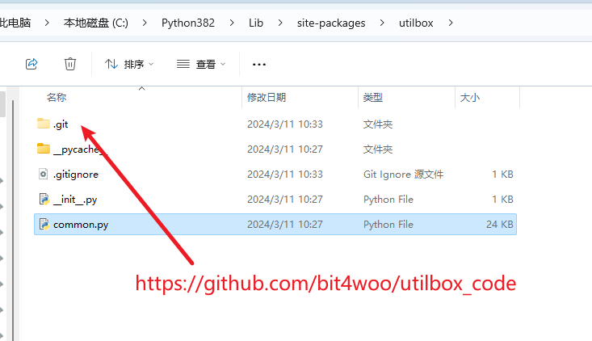
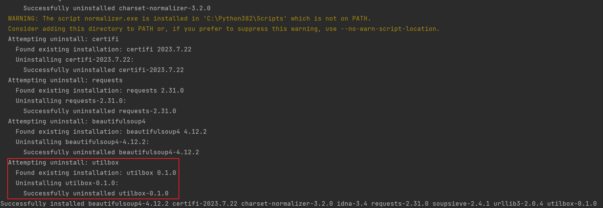

# utilbox

我的python常用函数合集，为了方便在多个项目间共享，创建了这个项目。

python环境：python3.8

由于可能经常更新这个包package，而不想维护版本，每次更新都需要重新安装到自己的环境中。


## 安装方法

一般情况下用这个方法就可以了

```
python3.8 -m pip uninstall --yes utilbox
python3.8 -m pip install git+https://github.com/bit4woo/utilbox.git
```

```
python3.8 -m pip uninstall --yes utilbox && python3.8 -m pip install git+https://github.com/bit4woo/utilbox.git
```
如果发生错误，可以用如下方法进行彻底重装，包括它的依赖包！
```
python3.8 -m pip install --force-reinstall git+https://github.com/bit4woo/utilbox.git
```


## 使用方法

```
import utilbox

utilbox.highlight_print("welcome","utilbox")
```


## setup.py的配置

setup的基本逻辑就是复制指定的目录或者文件到python环境相应的目录中。

如果package项目中，目录名称修改了，再使用这个package时，import xxx的名称也需要改！！！所以最好固定这个名称！！！（见【packge中源码目录变更对比测试】）


对于影响源码文件复制的参数：

- `packages` 和 `py_modules`：这两个参数指定了哪些源码文件将被复制和安装。`packages` 列出了包含子包和模块的目录，`py_modules` 列出了单个模块文件。
- `scripts`：这个参数指定要安装为脚本的文件路径，这些文件将被复制到系统的可执行路径下。

```
packages： 列出要包含在包中的子包和模块。这将影响哪些源码文件会被复制和安装。 
py_modules： 列出要包含在包中的单个模块文件。这将影响哪些单个模块文件会被复制和安装。
```


## 避免重复提交和安装-package源码文件直接修改

存在的问题，当在package的测试、使用过程中，如果发现package中的函数存在bug，想要修改其中代码时，基本步骤如下：

1、在原始项目中进行代码修改。

2、将代码变更提交到github。

3、使用以上安装方法重新拉取GitHub代码进行安装。

4、然而，代码调试往往需要多次修改，以上流程就需要多次重复，费时费力。


解决方案，利用submodule实现，package源码文件直接修改！

1、将安装后代码所在目录，作为git项目目录。C:\Python382\Lib\site-packages\utilbox



2、将以上项目，作为子模块，添加到当前项目中（包含readme文档，setup.py配置等等的项目）

```

cd D:\github\utilbox
git submodule add https://github.com/bit4woo/utilbox_code utilbox

注意：子模块的github地址是utilbox_code，但是它在主项目中对应的目录是utilbox！！！
```

3、当再发生需要修改源码的情况，直接修改安装目录中的代码即可！


-------------------------------------

​	以下是一些测试，帮助自己理解 python package

-------------------------------------


## packge中源码目录变更对比测试

pip 从github 安装时，使用指定的commit：

```
python3.8 -m pip install -I git+https://github.com/bit4woo/utilbox.git@babdb2ecdbdd636ecf81c93805a5f443f2ba0215
```


#### 1、源码目录是utilbox


#### 2、源码目录是utils


#### 3、函数调用的变化


## 强制【更新】命令对比测试

#### 1、--upgrade可以弃用了


#### 2、-I参数可以使用，但是存留垃圾文件，容易造成混淆困扰，也不建议使用


#### 3、最好还是先卸载再安装！


#### 4、目录不变，源码变化

```
当目录没有变化，源码变化时进行了测试，--upgrade没有更新源码，-I成功更新了源码
```


## 强制【重新安装】对比测试

由于可能经常更新这个包package，而不想维护版本，每次更新都需要重新安装到自己的环境中。参考以下方法：


0. **使用--force-reinstall自动全部卸载和安装（推荐）**

   除了当前包本身，它的依赖也会一起被卸载和重新安装

   ```
   python3.8 -m pip install --force-reinstall git+https://github.com/bit4woo/utilbox.git
   
   ```



1. **卸载后重新安装（推荐）：** 首先，卸载当前已安装的包，然后再重新安装它。您可以使用以下命令：

   ```bash
   python3.8 -m pip uninstall utilbox
   
   python3.8 -m pip install git+https://github.com/bit4woo/utilbox.git
   ```

2. **使用 `--upgrade` 参数（没用！！！）：** 使用 `--upgrade` 参数可以让 `pip` 在安装包时忽略已安装版本，强制安装最新版本。即使包的版本号没有变化，它也会重新下载并安装。使用以下命令：

   ```bash
   python3.8 -m pip install --upgrade git+https://github.com/bit4woo/utilbox.git
   ```

   

3. **使用 `-I` 参数（可用，不推荐）：** 在一些情况下，您可能需要使用 `-I` 参数来强制安装，即使包已经在环境中存在。使用以下命令：

   ```bash
   python3.8 -m pip install -I git+https://github.com/bit4woo/utilbox.git
   ```

   


## python setup.py install

```
python setup.py install --force
--force 参数，该参数可以强制覆盖已安装的包
```

当在项目目录中执行以上命令时，它没有将源码文件复制到 [site-packages](C:\Python382\Lib\site-packages) 中，而是生成了一个utilbox-0.1.0-py3.8.egg文件


